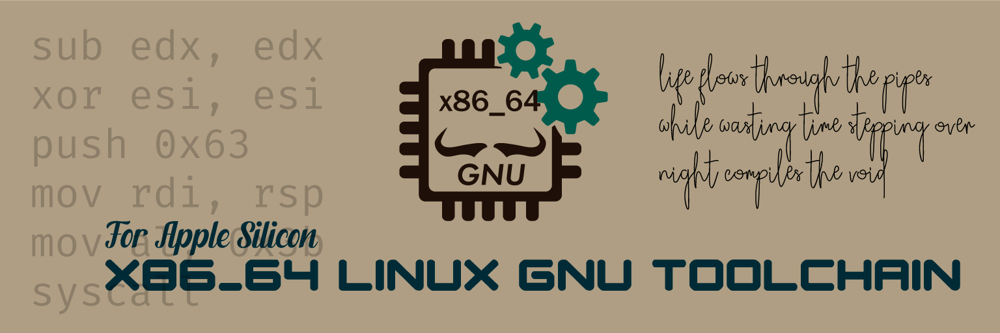

# x86_64 / i686 Linux Toolchain for Arch Linux ARM (Aarch64 Host)



Aim: I have an ArchLinux ARM64 machine. I want to build x86_64 (and i686)
Linux binaries on it, run the command line ones with QEMU user mode, debug them
with gdb, and copy the rest to a real x86 machine or VM.

| component         | version |
| ----------------- | ------- |
| gcc               | 16.2.0  |
| binutils          | 2.47    |
| glibc             | 2.44    |
| linux-api-headers | 7.2     |
| gdb               | 17.2    |
| zlib              | 1.3.2   |
| gmp               | 6.3.0   |

## Build and install order

Every step needs the previous one installed (`sudo pacman -U <pkg>`).

1. x86_64-linux-gnu-linux-api-headers
2. x86_64-linux-gnu-binutils
3. x86_64-linux-gnu-gcc-stage1 -> C only, no libc
4. x86_64-linux-gnu-glibc -> needs stage1
5. x86_64-linux-gnu-gcc -> remove stage1 before installing
6. x86_64-linux-gnu-gdb

`gcc-stage2` and `glibc-headers` are gone. The old five step bootstrap is not
needed any more, stage1 is enough to build glibc.

### Wrappers

Cross build helpers, same idea as in my mingw-w64 repo:

1. x86_64-linux-gnu-environment
2. x86_64-linux-gnu-pkg-config
3. x86_64-linux-gnu-configure
4. x86_64-linux-gnu-cmake

### Libraries

1. x86_64-linux-gnu-zlib
2. x86_64-linux-gnu-gmp
3. x86_64-linux-gnu-openssl-1.1 -> needs zlib
4. x86_64-linux-gnu-openssl-1.0 -> needs zlib

### X11 / OpenGL, raylib, Dear ImGui

1. xorgproto, xcb-proto, libxau, libxdmcp, libxcb, xtrans
2. libx11, libxext, libxrender, libxfixes, libxcursor, libxrandr, libxinerama, libxi
3. libglvnd, alsa-lib
4. sdl2, sdl3
5. raylib -> raygui
6. imgui -> rlimgui (needs raylib, sdl2, sdl3)
7. FLTK 1.3: libpng, libjpeg-turbo, expat, freetype2, fontconfig, libxft, glu -> fltk

GUI binaries are meant for a real x86 machine or VM. QEMU user mode can run the command
line ones; the window/GL part needs a display and a GL driver.

```bash
T=x86_64-linux-gnu
$T-g++ -std=c++17 app.cpp -o app $($T-pkg-config --cflags --libs --static rlImGui imgui_impl_opengl3 raylib)
$T-g++ -std=c++17 app.cpp -o app $($T-pkg-config --cflags --libs imgui_impl_sdlrenderer3 imgui_impl_sdl3)
```

## i686

The same set exists as `i686-linux-gnu-*` with its own sysroot `/usr/i686-linux-gnu`.
Same order, without gdb: `x86_64-linux-gnu-gdb` already debugs i386 binaries.

```bash
i686-linux-gnu-gcc -O2 -o hello hello.c
qemu-i386 -L /usr/i686-linux-gnu ./hello
```

## Use

```bash
x86_64-linux-gnu-gcc -O2 -o hello hello.c
qemu-x86_64 -L /usr/x86_64-linux-gnu ./hello
x86_64-linux-gnu-ldd hello

x86_64-linux-gnu-cmake -S . -B build -G Ninja
```

Debug under QEMU:

```bash
qemu-x86_64 -g 1234 -L /usr/x86_64-linux-gnu ./hello &
x86_64-linux-gnu-gdb -nx -q ./hello -ex 'set sysroot /usr/x86_64-linux-gnu' \
  -ex 'target remote :1234' -ex 'break main' -ex continue
```

OpenSSL: `-I/usr/x86_64-linux-gnu/include/openssl-1.1 -L/usr/x86_64-linux-gnu/lib/openssl-1.1`
(or `-1.0`).

## Resources

* [ArchLinux Packages][01]
* [ArchLinux AUR Packages][02]
* [Archlinux aarch64-linux-gnu-* packages][03]
* [Stackoverflow - How to solve "error while loading shared libraries" Thread][04]

## Author

BlueDeviL // SCT

## Last Words

> Life flows, bugs fly
>
> ---
>
> life flows through the pipes  
> wasting time stepping over  
> night compiles the void
>
> Blue DeviL // SCT
> 23/08/2025

## License

AGPLv3

[01]: https://archlinux.org/packages/
[02]: https://aur.archlinux.org/
[03]: https://gitlab.archlinux.org/archlinux/packaging/packages/aarch64-linux-gnu-gcc
[04]: https://stackoverflow.com/a/37281595
